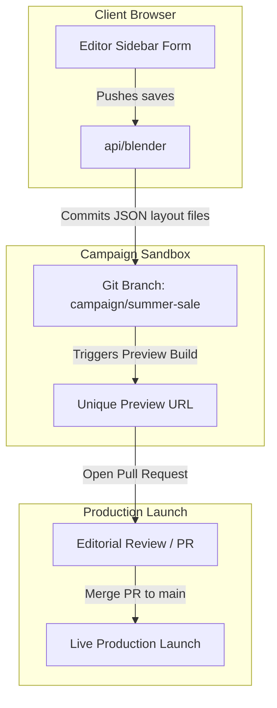

# Blender Next: Git-Backed Campaign Workflows

This guide covers how to manage e-commerce marketing campaigns (like a "Summer Sale") in **Blender Next** using standard Git branching and pull requests.

---

## 1. Branch-per-Campaign

Scheduling future campaigns in database-driven CMS platforms is historically painful. You usually end up wrangling draft states in database tables, writing custom release schedulers, and praying nothing goes live early.

Blender Next maps campaigns directly to Git branches. We treat branches as isolated campaign sandboxes:

### How the workflow behaves:
1.  **Start a Campaign**: An editor clicks "New Campaign: Summer Sale" in the dashboard. The server spins up a new Git branch: `campaign/summer-sale` branched off `main`.
2.  **Edit in Isolation**: All page changes, block reorderings, and copy edits are committed as simple JSON file updates directly to the `campaign/summer-sale` branch.
3.  **Preview and QA**: Hosting platforms (like Vercel or Netlify) build a unique preview URL for the branch automatically:
    `https://storefront-git-campaign-summer-sale.vercel.app`
    Stakeholders can QA the entire campaign storefront in isolation without touching the live production site.
4.  **Review the Diff**: Once the campaign looks good, the editor opens a Pull Request. Since layout data is flat JSON, developers and admins can review changes as code diffs.
5.  **Go Live**: Merging the PR triggers Next.js On-Demand ISR, instantly publishing the campaign globally across all pages.

---

## 2. Structural Benefits

*   **Fast Rollbacks**: If a campaign launches with broken layouts, reverting it takes seconds: `git revert <merge-commit-hash>`. All pages go back to their pre-campaign state instantly.
*   **Parallel Tracks**: Marketing teams can work on "Black Friday" and "Halloween Sale" campaigns at the same time in separate branches, with zero risk of database collisions.
*   **Built-in Auditing**: The Git commit log acts as a permanent, tamper-proof history of who changed what layout files and when.

---

## 3. Real-World Challenges & How to Solve Them

This setup is clean on paper, but you have to account for a few practical problems:

### A. Concurrency & Merge Conflicts
*   **The Problem**: If two editors try to save changes to the same page layout at the same time, Git will reject the second push. Editors cannot resolve Git merge conflicts.
*   **The Workaround**:
    *   **Pessimistic Locking**: Lock pages in the editor UI (using Redis or a simple database state) when someone is editing, preventing others from making concurrent changes.
    *   **Sub-branching**: Have the server commit changes to personal draft branches (e.g. `draft/john/summer-sale-hero`) and handle auto-merging behind the scenes.

### B. The Marketplace Catalog Sync Gap
*   **The Problem**: Git manages the *layout skeleton*, but it does not control the *live merchant catalog state*. If a campaign page references a new merchant or collection category that is not yet active in the marketplace registry, the preview frame will render empty grids or broken blocks.
*   **The Workaround**:
    *   **Align Schedules**: Ensure merchant menus or campaign promotions are scheduled to go live in the catalog services at the same time the Git PR merges.
    *   **Preview Bypass**: Configure storefront queries to pass coordinates and preview credentials to fetch draft restaurant menu listings in preview environments.

### C. Build Queue Saturation
*   **The Problem**: Saving layout tweaks every few minutes will trigger constant rebuilds, clogging the CI/CD pipeline and stalling preview generation.
*   **The Workaround**:
    *   **Buffer Saves**: Save edits locally in the browser, only committing to Git when the editor explicitly clicks "Push Draft".
    *   **Use ISR**: In preview environments, have storefront pages pull dynamic data at request time instead of triggering full static rebuilds.
