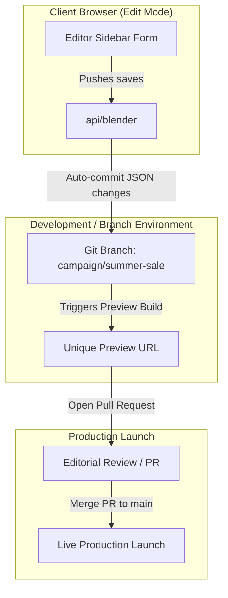

# Blender Next: Git-Backed Campaign Workflows

This document outlines the architectural vision for managing e-commerce marketing campaigns (e.g., a "Summer Sale") inside **Blender Next** using native Git primitives: **Branches for campaigns** and **Pull Requests for editorial reviews**.

---

## 1. The Core Vision: Branch-per-Campaign

In traditional headless CMS architectures, scheduling campaigns requires complex database versioning systems, release schedule tables, and draft/publish state management at the database row level. 

With Blender Next, we treat Git branches as isolated **campaign environments**:

### The Workflow:
1.  **Campaign Initialization**: An editor clicks "Create Campaign: Summer Sale" in the admin dashboard. Blender Next creates a new Git branch: `campaign/summer-sale` off `main`.
2.  **Isolated Edits**: All visual modifications, page creations, and block reorderings are committed as JSON file modifications directly to the `campaign/summer-sale` branch.
3.  **Preview Environments**: Cloud providers (like Vercel, Netlify, or AWS Amplify) automatically generate an isolated **preview URL** for the branch:
    `https://storefront-git-campaign-summer-sale.vercel.app`
    Stakeholders can browse and QA the entire storefront in its campaign state without affecting live production visitors.
4.  **Editorial Review (PR)**: When review is complete, the dashboard opens a **Pull Request** to merge `campaign/summer-sale` into `main`. Changes appear as clean JSON block diffs, easily readable by developers.
5.  **Atomic Launch**: Merging the PR triggers Next.js On-Demand Incremental Static Regeneration (ISR), instantly launching the campaign globally across all pages.

---

## 2. Structural Benefits

*   **Atomic Rollbacks**: If a campaign contains a critical layout error, reverting the entire campaign is a single command: `git revert <merge-commit-hash>`. This rolls back all modified pages globally in less than a second.
*   **Parallel Campaign Development**: Marketing teams can work on the "Black Friday" campaign in one branch and the "Halloween Sale" campaign in another, completely in parallel, without database pollution.
*   **Audit Trail & Compliance**: Every layout revision is tied to a Git author and commit log, providing automatic compliance logs.

---

## 3. Potential Bottlenecks & Operational Issues

While the vision is clean, a production system must address several operational issues:

### A. Concurrency & Merge Conflicts
*   **The Issue**: If two editors modify the same page layout on the campaign branch simultaneously, Git will reject the second push due to a conflict. Editors are not developers and cannot resolve raw JSON conflicts.
*   **The Mitigation**:
    *   **Pessimistic Locking**: When an editor opens a page in edit mode, the API sets a lock state (e.g. in Redis or SQLite) preventing others from editing.
    *   **Sub-branching**: Each editor works in an individual sub-branch (e.g. `draft/john/summer-sale-hero`) which the server automatically merges into the campaign branch. Simple JSON line changes (different blocks) are resolved automatically by Git.

### B. The PIM Catalog Synchronization Gap
*   **The Issue**: A Git branch controls the *CMS layout skeleton*, but it does not control the *live PIM database state*. If a campaign banner highlights a new product that has not yet been published or active in the e-commerce database (Shopify/Medusa), the preview branch will render broken blocks.
*   **The Mitigation**:
    *   **Scheduled Catalogs**: The e-commerce backend must support scheduled publishing.
    *   **Preview Queries**: The storefront fetch engine must query the PIM in "Preview Mode" (e.g. using bypass headers) to retrieve draft products when rendering preview branches.

### C. Build Queue Saturation
*   **The Issue**: Every Git push to a campaign branch triggers a preview build. If editors make frequent minor saves (e.g. fixing typos), the CI/CD build queue will clog, delaying previews.
*   **The Mitigation**:
    *   **Throttle Commits**: The admin editor should buffer page saves in a local storage draft state, only pushing a Git commit when the editor explicitly clicks "Commit Changes".
    *   **Next.js ISR**: Storefront rendering should leverage On-Demand ISR, checking the branch head dynamically at request time in preview environments rather than rebuilding static files.
