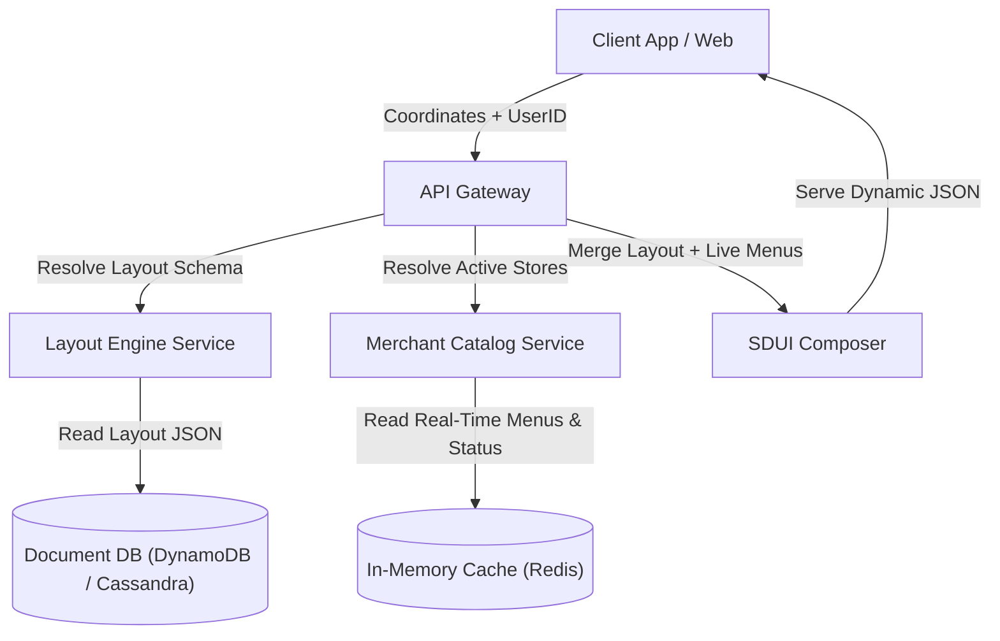

# Scale Viability: Can Git Scale for a Localized Marketplace?

In a localized marketplace architecture (similar to DoorDash), **Git is strictly a proof of concept**. While a Git-backed CMS works well for marketing landing pages or corporate blogs, it cannot handle the scale, concurrency, and real-time localization requirements of a delivery marketplace.

This document analyzes why Git fails for this use case and outlines the industry-standard architecture for high-throughput localized platforms.

---

## 1. Why Git Fails at Marketplace Scale

### A. High-Frequency Write Bottlenecks
*   **The Reality**: A food delivery marketplace has thousands of active merchants. Store operating hours, dynamic menu selections, out-of-stock items, and delivery fees change constantly. 
*   **The Git Limit**: Git is file-based and single-threaded for write lock operations. Pushing commits takes 1-3 seconds. Git cannot handle thousands of concurrent write transactions per second without lock queues clogging.

### B. Infinite Localization Coordinates
*   **The Reality**: Storefront homepages are dynamically tailored based on a user's *exact delivery coordinates* (lat/long geofencing). What you see depends on which restaurants deliver to your specific block.
*   **The Git Limit**: Git works on static file paths. Storing layouts statically per delivery coordinate is impossible because coordinates are continuous and infinite. We cannot pre-render or generate static JSON layout files per delivery coordinates in Git.

### C. Write Conflict Complexity
*   **The Reality**: Hundreds of merchants, marketing leads, and operations managers modify layouts and promotions in parallel.
*   **The Git Limit**: Parallel saves to the same files or directories in Git generate constant merge conflicts. Editors cannot resolve Git conflict headers, requiring developers to step in constantly.

---

## 2. Where Git Does Fit (The Hybrid Model)

Even in enterprise marketplaces, Git is still used, but it is restricted to slow-changing assets:
1.  **Application Code & Component Libraries**: React component files, styling variables, and Zod schemas live in Git and deploy via standard CI/CD.
2.  **Static Marketing Campaigns**: High-level promotional layout templates (e.g. "Super Bowl Sunday Campaign Template") that change weekly can live in Git and deploy via Pull Requests.

---

## 3. The Enterprise Architecture: Server-Driven UI (SDUI)

To scale localized layout deliveries, enterprise systems use a **Server-Driven UI (SDUI)** architecture backed by document databases and in-memory caches:

### The components:
1.  **Document Storage Layer**: Layout configurations and templates are stored in a distributed document database (like **Cassandra**, **AWS DynamoDB**, or **MongoDB Atlas**) instead of a Git repository. This provides sub-millisecond document reads at massive write scale.
2.  **In-Memory State Cache**: Real-time status data (operating hours, item availability, driver geolocations) are stored in high-throughput caches like **Redis** or **Memcached**.
3.  **The SDUI Engine**: The server does not return HTML. It returns a clean layout schema (e.g. `["HeroBanner", "PromoGrid", "MerchantList"]`) matched with real-time restaurant menu IDs near the user. The client application (React Native, iOS Swift, or Web) interprets this JSON and renders the components dynamically.
