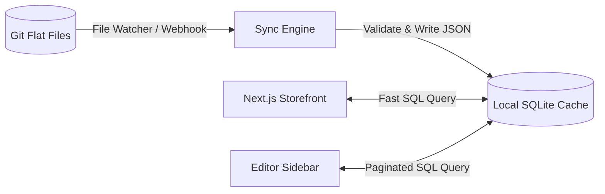

# Scaling Blender Next to 1,000s of Pages

While a flat-file Git CMS is excellent for smaller sites, managing hundreds or thousands of pages introduces architectural bottlenecks. This document outlines how Blender Next scales to handle 1,000+ pages efficiently without sacrificing developer experience, compilation times, or editor visual performance.

---

## The Bottlenecks of Scale in Git CMS
1.  **Read Bottleneck**: Scanning directories and parsing Zod models for thousands of JSON files on every dynamic request is CPU-intensive.
2.  **Build Bottleneck**: Pre-rendering 5,000 pages statically during the CI/CD build process will inflate build times from seconds to hours.
3.  **UI Bottleneck**: Rendering a list of 1,000+ pages in the editor sidebar will lag the browser DOM.

---

## 1. Solution: Local SQLite Indexing Cache (`.blender/cache.db`)

To solve the read bottleneck, Blender Next introduces a local SQLite cache database (such as a lightweight client-side file like `better-sqlite3` or a Bun-native SQLite database).



### How the Sync Engine works:
*   During development, a filesystem watcher (like `chokidar`) monitors `/content/pages`.
*   When `about.json` is added/updated, only that single file is read, validated via Zod, and its metadata (e.g. `id`, `title`, `slug`) is upserted into the SQLite database.
*   In production, the sync engine runs as a lightweight script during the initial build phase or as a Git commit hook.
*   **The Query Shift**: All load and list requests in Next.js query the SQLite database instead of scanning directories:
    ```typescript
    // Instead of fs.readdir and parsing every file, execute index-backed lookups:
    const pages = db.prepare('SELECT id, title FROM pages WHERE title LIKE ? LIMIT 20').all(`%${search}%`);
    ```
    This reduces page-lookup and list times from **seconds** to **less than 1 millisecond**.

---

## 2. Solution: Next.js Incremental Static Regeneration (ISR)

To prevent long build times in production, we do **not** statically pre-render all 1,000+ pages during build time. Instead, we use Next.js App Router **ISR**:

```tsx
// apps/storefront/src/app/[slug]/page.tsx
import { loadPageFromSqlite } from '@/lib/db';

// 1. Pre-render ONLY the top 50 most visited marketing/slug pages
export async function generateStaticParams() {
  const topPages = db.prepare('SELECT slug FROM pages ORDER BY views DESC LIMIT 50').all();
  return topPages.map(p => ({ slug: p.slug }));
}

// 2. Set dynamicParams to true (or omit it) to generate other pages on-demand
export const dynamicParams = true; 

export default async function Page({ params }) {
  // If the page is requested for the first time, Next.js renders it on-the-fly (SSR)
  // and caches it on the Vercel/Edge CDN (ISR) for future requests.
  const page = await loadPageFromSqlite(params.slug);
  
  if (!page) notFound();
  
  return <DynamicPageClient initialData={page} slug={params.slug} />;
}
```
*   **Result**: Your Next.js deployment remains fast (typically under 1 minute) regardless of whether you have 100 pages or 10,000 pages.

---

## 3. Solution: API-Level Pagination & Lazy Loading

For the editor UI dashboard, listing all files is replaced by query-driven listing.

### Updated Page API Endpoint:
```typescript
// apps/storefront/src/app/api/blender/route.ts
export async function GET(request: Request) {
  const { searchParams } = new URL(request.url);
  const page = parseInt(searchParams.get('page') || '1');
  const limit = parseInt(searchParams.get('limit') || '20');
  const search = searchParams.get('search') || '';
  
  const offset = (page - 1) * limit;
  
  // Executed on SQLite database
  const pages = db.prepare(
    'SELECT id, title FROM pages WHERE id LIKE ? OR title LIKE ? LIMIT ? OFFSET ?'
  ).all(`%${search}%`, `%${search}%`, limit, offset);

  return NextResponse.json({ pages });
}
```

*   **Editor Panel UI**: In [`admin/page.tsx`](../apps/storefront/src/app/admin/page.tsx), we replace the raw page list with a search input and an **infinite-scroll list** that calls `GET /api/blender?page=2...` as the user scrolls.

---

## 4. Git Merge Conflict Resolution Strategy

With hundreds of pages and multiple editors, merge conflicts can arise:
1.  **Separate Files**: By storing each page as a separate JSON file (e.g. `about.json`, `team.json`), editors working on different pages will never experience merge conflicts.
2.  **Visual Branching**: In production, when an editor logs into the admin portal, they can choose to edit in a "Draft Branch" (e.g., `draft/new-about-page`). Blender Next creates a new Git branch, saves edits there, and issues a Pull Request in GitHub/GitLab, allowing developers to review and resolve any conflicts before merging.
