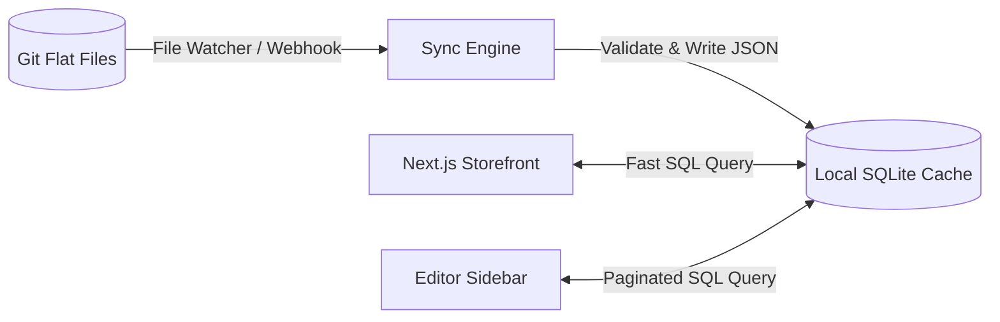

# Scaling Blender Next to 1,000s of pages

A flat-file Git layout setup is clean for smaller storefronts, but scanning folders and parsing Zod models for thousands of JSON files will slow down dynamic requests and balloon build times. 

Here is how Blender Next scales to support thousands of pages without degrading build pipelines or editor performance.

---

## The scaling bottlenecks
1.  **Read performance**: Running `fs.readdir` and parsing Zod schemas for thousands of files on every request is CPU-intensive.
2.  **Build queue congestion**: Pre-rendering 5,000 static pages during the CI/CD build will inflate build times from seconds to hours.
3.  **Dashboard lag**: Rendering a list of 1,000+ pages in the editor sidebar will lag the browser DOM.

---

## 1. Cache pages locally with SQLite (`.blender/cache.db`)

To avoid reading the filesystem constantly, Blender Next uses a local SQLite cache database (using a lightweight engine like `better-sqlite3` or a Bun-native SQLite connection).



### How the sync engine behaves:
*   In development, a watcher (like `chokidar`) monitors `/content/pages`.
*   When a file like `about.json` is saved, only that file is validated and upserted into the SQLite cache.
*   In production, the sync script runs once during the initial build or as a Git commit hook.
*   **Querying the cache**: All dynamic routes query the SQLite index instead of scanning directories:
    ```typescript
    // We execute index-backed queries instead of fs.readdir:
    const pages = db.prepare('SELECT id, title FROM pages WHERE title LIKE ? LIMIT 20').all(`%${search}%`);
    ```
    This drops page lookup and listing times to **less than 1 millisecond**.

---

## 2. Use Next.js Incremental Static Regeneration (ISR)

We do not pre-render all 1,000+ pages at build time. Instead, we use Next.js App Router **ISR** to generate pages on-demand:

```tsx
// apps/storefront/src/app/[slug]/page.tsx
import { loadPageFromSqlite } from '@/lib/db';

// 1. Pre-render ONLY the top 50 most visited marketing/slug pages
export async function generateStaticParams() {
  const topPages = db.prepare('SELECT slug FROM pages ORDER BY views DESC LIMIT 50').all();
  return topPages.map(p => ({ slug: p.slug }));
}

// 2. Set dynamicParams to true to generate other pages on-demand
export const dynamicParams = true; 

export default async function Page({ params }) {
  // If the page is requested for the first time, Next.js renders it on-the-fly (SSR)
  // and caches it on the Vercel/Edge CDN (ISR) for future requests.
  const page = await loadPageFromSqlite(params.slug);
  
  if (!page) notFound();
  
  return <DynamicPageClient initialData={page} slug={params.slug} />;
}
```
*   **Deployment impact**: Next.js builds remain fast (typically under 1 minute) regardless of whether you have 100 pages or 10,000 pages.

---

## 3. Paginate the editor list API

For the editor UI, listing all files is replaced by query-driven paging.

### Updated page API route:
```typescript
// apps/storefront/src/app/api/blender/route.ts
export async function GET(request: Request) {
  const { searchParams } = new URL(request.url);
  const page = parseInt(searchParams.get('page') || '1');
  const limit = parseInt(searchParams.get('limit') || '20');
  const search = searchParams.get('search') || '';
  
  const offset = (page - 1) * limit;
  
  // Query the SQLite cache
  const pages = db.prepare(
    'SELECT id, title FROM pages WHERE id LIKE ? OR title LIKE ? LIMIT ? OFFSET ?'
  ).all(`%${search}%`, `%${search}%`, limit, offset);

  return NextResponse.json({ pages });
}
```

*   **Editor Panel UI**: In [`admin/page.tsx`](../apps/storefront/src/app/admin/page.tsx), we replace the full list with a search input and an **infinite-scroll list** that calls `GET /api/blender?page=2...` as the user scrolls.

---

## 4. Handling merge conflicts

With hundreds of pages and multiple editors, merge conflicts can arise. We solve this through:
1.  **Separate layout files**: Storing each page as its own JSON file (e.g. `about.json`, `team.json`) ensures editors working on different pages never conflict.
2.  **Branch-based campaigns**: For shared changes, editors work on isolated campaign branches (`draft/new-about-page`). Saves push commits to that branch and trigger a Pull Request, allowing conflicts to be managed cleanly before merging.
